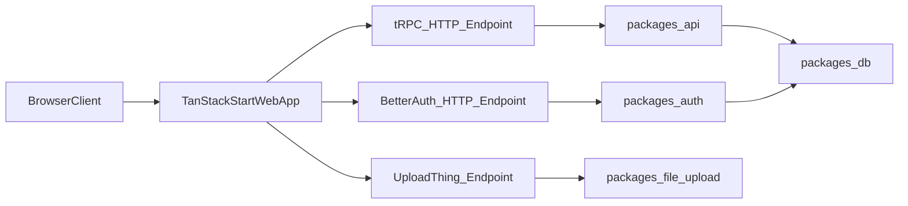

# TanStack Start Full Migration Plan

## Primary Reference

- TanStack official migration guide: [Migrate from Next.js](https://tanstack.com/start/latest/docs/framework/react/migrate-from-next-js)
- t3-oss reference implementation PR: [chore: add tanstack start example app #1431](https://github.com/t3-oss/create-t3-turbo/pull/1431/changes#diff-eb39160f6a2f6c5db1d606f6e3ba60692c7cf99f87b3390ae6451990099454a7)
- This plan follows that guide's baseline sequence (remove Next config/deps, add Vite + Start, convert root/layout/routes, convert server handlers) and extends it for your monorepo-specific parity requirements (tRPC, Better Auth, UploadThing, Sentry, Speed Insights, Playwright).
  It also incorporates the PR's monorepo package conventions (`apps/tanstack-start`, Vite plugin wiring, routeTree generation, Better Auth React Start cookies, tRPC route handlers, env-core usage, and workspace lint/format ignores).

## Goal

Replace the current Next.js web app with a TanStack Start web app using a **parallel-then-cutover** approach, while preserving all current behavior and integrations on **Vercel Node runtime**.

## Current-State Findings (What drives the plan)

- Next.js is concentrated in `[/home/gravender/personal/games/apps/nextjs](/home/gravender/personal/games/apps/nextjs)`, including app router routes, middleware, and API handlers.
- Full parity scope includes Better Auth, tRPC, UploadThing, Sentry, and Vercel Speed Insights.
- Framework-coupled server code is currently anchored in:
  - `[/home/gravender/personal/games/apps/nextjs/src/app/api/trpc/[trpc]/route.ts](/home/gravender/personal/games/apps/nextjs/src/app/api/trpc/[trpc]/route.ts)`
  - `[/home/gravender/personal/games/apps/nextjs/src/app/api/auth/[...all]/route.ts](/home/gravender/personal/games/apps/nextjs/src/app/api/auth/[...all]/route.ts)`
  - `[/home/gravender/personal/games/apps/nextjs/src/app/api/uploadthing/route.ts](/home/gravender/personal/games/apps/nextjs/src/app/api/uploadthing/route.ts)`
  - `[/home/gravender/personal/games/apps/nextjs/src/auth/server.ts](/home/gravender/personal/games/apps/nextjs/src/auth/server.ts)`
  - `[/home/gravender/personal/games/apps/nextjs/middelware.ts](/home/gravender/personal/games/apps/nextjs/middelware.ts)`

## Migration Strategy (Parallel Build -> Cutover)

1. Create a new TanStack Start app (`apps/tanstack-start`) and wire monorepo scripts/tasks without removing Next.js yet.
2. Move framework-agnostic domain/UI logic first (forms, components, validation, shared route helpers), then adapt router/server boundaries.
3. Rebuild server integrations in TanStack Start equivalents (auth handler, tRPC HTTP endpoint, upload endpoints, request context).
4. Add observability/perf integrations for parity (Sentry + Speed Insights equivalent instrumentation).
5. Run route-by-route parity verification against current Next.js app.
6. Cut over workspace dev/build scripts and E2E defaults to TanStack Start.
7. Remove Next.js app and stale Next-only deps/config once parity is validated.

## Official-Guide Mapping (Next.js -> TanStack Start)

- `src/app/layout.tsx` -> `src/app/__root.tsx` with `HeadContent`, `Scripts`, `Outlet`, and CSS link registration.
- `src/app/page.tsx` -> `src/app/index.tsx` with `createFileRoute('/')`.
- Next route handlers (`route.ts`) -> TanStack Start server routes (`server.handlers`).
- `next/link`, `next/navigation` -> `@tanstack/react-router` (`Link`, route hooks, navigation helpers).
- `next/image` -> TanStack-compatible image approach (native `img` or `@unpic/react` where optimization/parity is needed).
- `next/font/google` -> CSS/Tailwind font setup (no Next font runtime dependency).
- `next.config.` + Next build scripts -> Vite config + TanStack Start plugin + Node start of `.output/server/index.mjs`.

## Workstreams

### 1) App Scaffolding and Workspace Wiring

- Add `apps/tanstack-start` with TypeScript, Tailwind, TanStack Router/Start conventions.
- Mirror proven baseline from PR #1431:
  - `vite.config.ts` with `tanstackStart(...)`, `vite-tsconfig-paths`, `@tailwindcss/vite`, and React plugin.
  - `src/router.tsx` + generated `src/routeTree.gen.ts`.
  - app-level ignore/setup for generated files (`routeTree.gen.ts`) in formatting/watch rules.
- Update root scripts in `[/home/gravender/personal/games/package.json](/home/gravender/personal/games/package.json)` to include `dev:tanstack-start`, then make it the default web dev target after parity.
- Update turbo tasks in `[/home/gravender/personal/games/turbo.json](/home/gravender/personal/games/turbo.json)` and app-level turbo config to include new build outputs and runtime env pass-through.
- Keep `apps/nextjs` runnable during migration for side-by-side validation.

### 2) Routing, Layouts, and Page Migration

- Port route tree from Next App Router folders under `[/home/gravender/personal/games/apps/nextjs/src/app](/home/gravender/personal/games/apps/nextjs/src/app)` to TanStack file routes.
- Map Next-specific conventions to TanStack equivalents:
  - `layout.tsx` -> root/nested route layouts
  - `loading.tsx` -> pending UI boundaries
  - `not-found.tsx` -> route notFound handlers
  - `global-error.tsx` -> route/root error boundaries
- Replace `next/link` and `next/navigation` usage with TanStack navigation APIs across components in `[/home/gravender/personal/games/apps/nextjs/src/components](/home/gravender/personal/games/apps/nextjs/src/components)`.

### 3) Server Runtime and API Endpoints

- Recreate tRPC endpoint behavior currently in `[/home/gravender/personal/games/apps/nextjs/src/app/api/trpc/[trpc]/route.ts](/home/gravender/personal/games/apps/nextjs/src/app/api/trpc/[trpc]/route.ts)` using TanStack Start server handlers and equivalent request context.
- Recreate Better Auth endpoint currently in `[/home/gravender/personal/games/apps/nextjs/src/app/api/auth/[...all]/route.ts](/home/gravender/personal/games/apps/nextjs/src/app/api/auth/[...all]/route.ts)` with TanStack-compatible HTTP entrypoint.
- Follow PR #1431 route shape for parity:
  - `src/routes/api/trpc.$.ts` pattern for tRPC server route.
  - `src/routes/api/auth.$.ts` pattern for auth catch-all route.
- Replace Next middleware logic from `[/home/gravender/personal/games/apps/nextjs/middelware.ts](/home/gravender/personal/games/apps/nextjs/middelware.ts)` using TanStack Start route guards/server middleware patterns.
- Replace UploadThing Next adapter in `[/home/gravender/personal/games/apps/nextjs/src/app/api/uploadthing/route.ts](/home/gravender/personal/games/apps/nextjs/src/app/api/uploadthing/route.ts)` and any `uploadthing/next` usage in `[/home/gravender/personal/games/packages/file-upload/src/index.ts](/home/gravender/personal/games/packages/file-upload/src/index.ts)` with framework-neutral/server-runtime-compatible handlers.

### 4) Auth, Env, and Shared Runtime Contracts

- Decouple auth server context from `next/headers` in `[/home/gravender/personal/games/apps/nextjs/src/auth/server.ts](/home/gravender/personal/games/apps/nextjs/src/auth/server.ts)` into request-agnostic helpers consumed by TanStack handlers.
- Replace Next-specific env wrappers (`@t3-oss/env-nextjs`) in:
  - `[/home/gravender/personal/games/apps/nextjs/src/env.ts](/home/gravender/personal/games/apps/nextjs/src/env.ts)`
  - `[/home/gravender/personal/games/packages/api/src/env.ts](/home/gravender/personal/games/packages/api/src/env.ts)`
    with runtime-neutral env validation while preserving existing variables.
- Align env/auth implementation style with PR #1431:
  - Prefer `@t3-oss/env-core` (+ Vercel preset) with TanStack client prefix semantics.
  - Use Better Auth React Start cookie plugin equivalent (`reactStartCookies`) for session continuity.
- Keep Vercel Node-compatible runtime assumptions and URL/environment resolution parity.

### 5) UI/Asset and Framework API Replacements

- Replace `next/image` usage with TanStack-compatible image strategy (native `img` or app-level image utility with remote allowlist logic).
- Replace `next/font/google` in `[/home/gravender/personal/games/apps/nextjs/src/app/layout.tsx](/home/gravender/personal/games/apps/nextjs/src/app/layout.tsx)` with standard web font loading.
- Replace Next metadata APIs with document/head management in TanStack route configuration.

### 6) Observability and Performance Tooling

- Migrate Sentry setup from Next-specific wiring:
  - `[/home/gravender/personal/games/apps/nextjs/next.config.js](/home/gravender/personal/games/apps/nextjs/next.config.js)`
  - `[/home/gravender/personal/games/apps/nextjs/src/instrumentation.ts](/home/gravender/personal/games/apps/nextjs/src/instrumentation.ts)`
  - `[/home/gravender/personal/games/apps/nextjs/src/instumentation-client.ts](/home/gravender/personal/games/apps/nextjs/src/instumentation-client.ts)`
    to TanStack/Vite/server entry instrumentation.
- Replace `@vercel/speed-insights/next` usage in `[/home/gravender/personal/games/apps/nextjs/src/components/speedInsights.tsx](/home/gravender/personal/games/apps/nextjs/src/components/speedInsights.tsx)` with the non-Next package variant.

### 7) Testing and Cutover

- Update Playwright web target defaults in `[/home/gravender/personal/games/tooling/playwright-web](/home/gravender/personal/games/tooling/playwright-web)` to the TanStack app dev server and base URL behavior.
- Execute package checks (`turbo run check --filter=...`) for changed packages and route-level smoke tests.
- Perform side-by-side acceptance checklist (auth/session, protected routes, CRUD flows, uploads, error pages, analytics).
- Once green: switch default web scripts to TanStack Start, remove `apps/nextjs`, remove Next-only deps/config, and clean lockfile.

## Dependency/Flow Map (Target)

## Risks and Mitigations

- Route semantics drift (App Router to TanStack): migrate by route groups and validate each with Playwright smoke paths.
- Auth/session regressions from request-context changes: centralize context adapter tests early.
- UploadThing adapter mismatch: isolate upload server adapter into one module to simplify fallback/patching.
- Observability gaps during transition: enable Sentry in parallel app before traffic cutover.

## Acceptance Criteria

- TanStack Start app runs all current web flows with parity.
- tRPC, Better Auth, and UploadThing endpoints all function in dev and Vercel Node deployment.
- Sentry and Speed Insights equivalents emit data in staging.
- Playwright web suite passes against TanStack Start target.
- Next.js app and Next-only dependencies/config are fully removed post-cutover.
