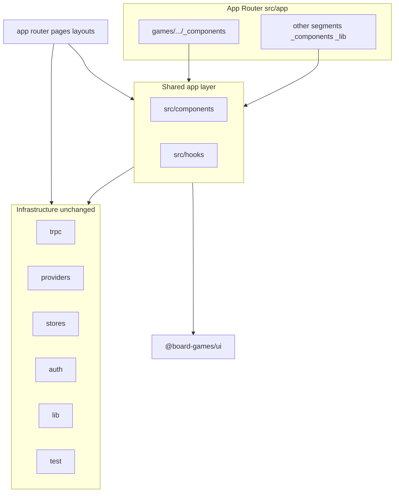

# Route colocation + shared roots (web + skills)

**Next.js reference (canonical)**: Follow [**Project structure and organization**](https://nextjs.org/docs/app/getting-started/project-structure) in the App Router docs — folder/file conventions, **colocation**, **private folders** (`_folderName`), **route groups** (`(folderName)`), dynamic segments (`[param]`), and the **`src` directory** option (this app uses `apps/web/src/app`).

**Canonical location**: This umbrella and the four phase plans live in the monorepo under [`.cursor/plans/`](.) (same directory as this file).

| Doc                                                                                     | Role                                                                        |
| --------------------------------------------------------------------------------------- | --------------------------------------------------------------------------- |
| [web_vertical_restructure_0596f2bd.plan.md](web_vertical_restructure_0596f2bd.plan.md)  | Umbrella (this file)                                                        |
| [Phase 1 — leaf + shared](web_vertical_restructure_phase1_leaf_and_shared.plan.md)      | Shared foundations, destructive-dialog consolidation, leaf route colocation |
| [Phase 2 — core domains](web_vertical_restructure_phase2_core_domains.plan.md)          | game + match + player toward `games/.../_components` + hooks cleanup        |
| [Phase 3 — cleanup + docs](web_vertical_restructure_phase3_cleanup_and_docs.plan.md)    | Skills, CLAUDE, rules; path sweep                                           |
| [Phase 4 — auth shell + URLs](web_vertical_restructure_phase4_auth_route_group.plan.md) | `(auth)` layout, flat `/games` routes, redirects                            |

## Principles (aligned with Next.js docs)

Docs summary: Next.js is **unopinionated** about naming beyond **special files** (`layout`, `page`, `loading`, `error`, `not-found`, `route`, etc.). It documents three broad strategies: (1) **store shared code outside `app`**, (2) shared folders **inside** `app`, (3) **split by feature or route** — global shared + segment-specific colocation. This plan uses **(1) + (3)**.

- **Do not create `src/features/`**. Shared application code lives under **`src/components`**, **`src/hooks`**, and other `src/*` roots ([`src` folder](https://nextjs.org/docs/app/api-reference/file-conventions/src-folder)), with **`src/app`** holding the App Router tree.
- **Route segments** map to URL paths; only a **`page.tsx`** or **`route.ts`** makes a segment publicly addressable. Other files colocated in a segment are **not** sent as routes by default ([colocation](https://nextjs.org/docs/app/getting-started/project-structure#colocation)).
- **Private folders** (`_folderName`) opt a tree out of the routing system explicitly. The docs example is `app/blog/_components/Post.tsx` — **not routable**; safe for UI utilities. **Prefer `_components`** for route-local widgets (matches the doc pattern and avoids clashes with future special file names). Optional `_lib` for segment-local helpers is consistent with the same page.
- **Route groups** `(folderName)` organize layouts and omit the folder from the URL ([route groups](https://nextjs.org/docs/app/api-reference/file-conventions/route-groups)). Phase 4’s **`(auth)`** group follows this: shared authenticated **shell** in `app/(auth)/layout.tsx` without adding `/auth` to URLs.
- **Dynamic routes** use `[segment]` (and optional catch‑all / optional catch‑all per docs). Example colocation: `src/app/(auth)/games/[id]/matches/[matchId]/_components/...` — adjust segment names to match this repo’s folders.
- **Shared across many routes** (sidebar, confirm dialogs, spinners, form helpers) stays in **`src/components`**; design primitives in **`@board-games/ui`**. **Hooks** used from multiple routes stay in **`src/hooks/`**; move a hook beside a route only if it is **single-route** private (e.g. next to `_components` or `_lib` in that segment).
- **`app/**`integration**:`page.tsx`/`layout.tsx`import from`~/components/...`, `~/hooks/...`, and **relative** imports from `./\_components/...`/`./\_lib/...`.

## Generic patterns (destructive confirm, similar dialogs)

The app already has [`apps/web/src/components/confirm-delete-dialog.tsx`](../../apps/web/src/components/confirm-delete-dialog.tsx) — a thin wrapper around `@board-games/ui/alert-dialog` with destructive styling and async-safe confirm handling. **Treat this as the single pattern** for “user is about to delete (or irreversibly remove) something.”

**Conventions**

- **Prefer the shared component** over ad-hoc `AlertDialog` trees in feature code for the same UX (title, description, Cancel, destructive confirm, loading on confirm). Today several call sites still use raw `AlertDialog` (e.g. some dropdowns and sheets); **Phase 1** should **refactor those** to `ConfirmDeleteDialog` (or a renamed **`ConfirmDestructiveDialog`** if you generalize copy beyond “Delete”) so behavior and a11y stay consistent.
- **Naming**: keep one canonical export per concern (delete/destructive confirm, info modal, etc.); avoid duplicating near-identical wrappers beside individual routes.
- **Where it lives**: **`src/components/`** (e.g. `~/components/confirm-delete-dialog`), not under a new `features/` tree. **Optional later**: move to [`packages/ui`](../../packages/ui) if you want the same API in **`apps/native`** without copy-paste — only if the API stays presentation-only (no web-only assumptions).

**Similar future patterns**: same idea — one shared component for each recurring shape (e.g. “info” explainer modal → existing `feature-info-modal` pattern), not N slight variations per route.

## Target layout (`apps/web/src`)

**What moves where (conceptual)**

| Kind                                                             | Location                                                                                                                                                                          |
| ---------------------------------------------------------------- | --------------------------------------------------------------------------------------------------------------------------------------------------------------------------------- |
| Shared widgets, layout chrome helpers, cross-route tables/modals | `src/components/**`                                                                                                                                                               |
| Shared tRPC/React Query modules used from multiple routes        | `src/hooks/**` (keep existing `queries/`, `mutations/`, `invalidate/`, etc.)                                                                                                      |
| UI only used by one route subtree                                | `src/app/.../<segment>/_components/**` (nested per dynamic segment; **private folder** per [docs](https://nextjs.org/docs/app/getting-started/project-structure#private-folders)) |
| Segment-only helpers (optional)                                  | `src/app/.../_lib/**` (same private-folder pattern as `_components`)                                                                                                              |

**Path aliases**: [`apps/web/tsconfig.json`](../../apps/web/tsconfig.json) keeps `"~/*": ["./src/*"]` so shared imports stay `~/components/...`, `~/hooks/...`. Route-local imports use **relative** paths from `page.tsx` / `layout.tsx` into `./_components/...` and `./_lib/...`.

**Do not** delete `src/components` or `src/hooks` as an end goal — they remain the shared home.

## Migration approach (recommended)

- **Order by dependency**: tighten shared patterns first (ConfirmDeleteDialog, shell imports), then move **leaf** route trees (group, location, friend, …) toward colocated components, then **game / match / player** (dense cross-imports — still one batch if possible).
- **After each chunk**: `turbo run check --filter=web` and `bun run test:web` (Vitest aliases already match `~` → [`apps/web/vitest.config.ts`](../../apps/web/vitest.config.ts)).
- **Import updates**: route files import from `~/components/...` / `~/hooks/...` for shared code; from `./_components/...` (and `./_lib/...` if used) for colocated UI. When extracting from a large `src/components/<domain>/` folder, move files into the **closest** route segment that owns them; leave only genuinely shared pieces under `src/components`.

## Dealing with cross-imports (game / match / player)

The problem is not TypeScript itself — it is **avoiding a long-lived hybrid** where some imports use old paths and others use new colocated paths.

**Preferred approach: migrate the trio in one atomic change**

- Move game/match/player **route-specific** UI into the appropriate `games/.../_components` (and sibling routes such as `players/...` where applicable) **together** with hook import updates, then run one bulk import rewrite.
- Shared pieces that **multiple** game routes use stay in `src/components` or stay in `src/hooks` until there is a clear reason to split.

**If you must split work across time**

- **Do not** leave only one of the three domains half-migrated — that maximizes confusing cross-boundary imports.
- Acceptable: finish **Phase 1** (shared + leaf routes) and merge; then **Phase 2** does game+match+player in one PR.

**Mechanical scale**

- Treat rewrites as **scripted or codemod-scale** where possible; let **`turbo run check --filter=web`** and **`bun run test:web`** be the gate.

## Phased plans (split into multiple deliverables)

This umbrella plan stays the **architecture reference**. Split execution into **separate plan files** (or PRs) so each merge is reviewable and main stays green.

| Phase       | Scope                                                                                                                                                                                                                                                                                                                       | Plan file (monorepo)                                                                                                 |
| ----------- | --------------------------------------------------------------------------------------------------------------------------------------------------------------------------------------------------------------------------------------------------------------------------------------------------------------------------- | -------------------------------------------------------------------------------------------------------------------- |
| **Phase 1** | Shared foundations (destructive dialog consolidation, shell organization under `src/components`), leaf domains colocated under their routes — **not** `game`/`match`/`player` yet.                                                                                                                                          | [web_vertical_restructure_phase1_leaf_and_shared.plan.md](web_vertical_restructure_phase1_leaf_and_shared.plan.md)   |
| **Phase 2** | **`game` + `match` + `player`**: move toward `games/.../_components` (and related route folders), keep shared hooks in `src/hooks` unless truly page-private                                                                                                                                                                | [web_vertical_restructure_phase2_core_domains.plan.md](web_vertical_restructure_phase2_core_domains.plan.md)         |
| **Phase 3** | Update **skills/docs** ([`.cursor/skills/web-app-src-conventions/SKILL.md`](../../.cursor/skills/web-app-src-conventions/SKILL.md), [`CLAUDE.md`](../../CLAUDE.md), [`.cursor/rules/tanstack-form-subscribe-selector.mdc`](../../.cursor/rules/tanstack-form-subscribe-selector.mdc)); `rg` sweep for stale path references | [web_vertical_restructure_phase3_cleanup_and_docs.plan.md](web_vertical_restructure_phase3_cleanup_and_docs.plan.md) |
| **Phase 4** | **App Router: `(auth)` shell + flatten URLs** — sidebar layout on `app/(auth)/layout.tsx`; **`/dashboard` = overview only**; product routes at **`/games`, `/players`, `/groups`, …** (not under `/dashboard`). See [Phase 4 details](#phase-4-authenticated-app-shell-auth-route-group).                                   | [web_vertical_restructure_phase4_auth_route_group.plan.md](web_vertical_restructure_phase4_auth_route_group.plan.md) |

**Dependency rule**: Phase 1 should land **ConfirmDeleteDialog** consolidation and stable **shell** paths under `src/components` before Phase 2 churn on game/match/player.

**Phase 4 dependency**: Prefer running after **Phase 1** so `AppSidebar` / shell imports are stable, and after route moves where possible so layout files do not reference obsolete paths. **URL change**: most paths move from `/dashboard/<segment>` to `/<segment>` — plan redirects (see Phase 4) for old links.

**Optional later**: `eslint-plugin-boundaries` between `app/` and `src/components` — not required for folder moves.

## Phase 4: Authenticated app shell `(auth)` route group

Per [Route groups](https://nextjs.org/docs/app/api-reference/file-conventions/route-groups): folders in parentheses **do not** appear in the URL; use them to share a **`layout.tsx`** across a subtree. **`layout`** wraps child segments ([layout convention](https://nextjs.org/docs/app/api-reference/file-conventions/layout)).

**Problem today**: The sidebar + session gate live in [`apps/web/src/app/dashboard/layout.tsx`](../../apps/web/src/app/dashboard/layout.tsx). Almost all product routes are nested as **`/dashboard/games`, `/dashboard/players`, …**, so “dashboard” is both the **home overview** and the **parent prefix for the whole app**, which is noisy and deep.

**Goals (two parts)**

1. **Shell**: Add a **route group** [`src/app/(auth)/`](../../apps/web/src/app) (parentheses = **no extra URL segment**) whose **`layout.tsx`** owns the authenticated shell: `SidebarProvider`, `AppSidebar`, header with breadcrumbs + theme toggle, and the `session` check / `redirect("/")` when unauthenticated — i.e. lift the current `SidebarLayout` from [`dashboard/layout.tsx`](../../apps/web/src/app/dashboard/layout.tsx) into **`app/(auth)/layout.tsx`**.
2. **Flat URLs**: Under `(auth)`, **only** the overview uses the `/dashboard` segment. Feature routes become **top-level paths** next to it, not children of `dashboard`:

| Current (typical)                                                                                                                               | Target                                                                                                                                                                                                   |
| ----------------------------------------------------------------------------------------------------------------------------------------------- | -------------------------------------------------------------------------------------------------------------------------------------------------------------------------------------------------------- |
| `/dashboard`                                                                                                                                    | `/dashboard` — **unchanged**; stays the logged-in home / charts ([`app/dashboard/page.tsx`](../../apps/web/src/app/dashboard/page.tsx) + [`_components/`](../../apps/web/src/app/dashboard/_components)) |
| `/dashboard/games`, `/dashboard/games/...`                                                                                                      | `/games`, `/games/...`                                                                                                                                                                                   |
| `/dashboard/players`, `/dashboard/players/...`                                                                                                  | `/players`, `/players/...`                                                                                                                                                                               |
| `/dashboard/groups`, `/dashboard/friends`, `/dashboard/locations`, `/dashboard/calendar`, `/dashboard/share-requests`, `/dashboard/settings`, … | `/groups`, `/friends`, `/locations`, `/calendar`, `/share-requests`, `/settings`, … (same path suffixes and dynamic segments after the first segment)                                                    |

**Filesystem layout (illustrative)** — paths under `apps/web/src/app/`

- `(auth)/layout.tsx` — sidebar shell + session gate ([`layout` file](https://nextjs.org/docs/app/api-reference/file-conventions/layout)).
- `(auth)/dashboard/page.tsx` (+ `(auth)/dashboard/_components/`) — **only** dashboard overview widgets; **`page`** exposes `/dashboard` ([`page` file](https://nextjs.org/docs/app/api-reference/file-conventions/page)).
- `(auth)/games/**`, `(auth)/players/**`, `(auth)/groups/**`, … — moved from today’s `dashboard/<segment>/**` (URL segments no longer under `/dashboard/...`).

**Concrete steps**

1. Add **`src/app/(auth)/layout.tsx`** with the same shell behavior as today’s dashboard layout (imports from `~/components/...` for shell pieces after restructure).
2. **Split** the current [`app/dashboard`](../../apps/web/src/app/dashboard) tree:
   - Keep **`dashboard/page.tsx`** and **`dashboard/_components/`** under `src/app/(auth)/dashboard/` (overview only).
   - **Move** each other first-level segment (`games`, `players`, `groups`, `locations`, `friends`, `calendar`, `share-requests`, `settings`, …) to **`src/app/(auth)/<segment>/`** at the **root of the group** (siblings of `dashboard/`), so URLs flatten as in the table above. Preserve each segment’s **`_components`** (and other private folders) when moving.
3. **Remove** the old `app/dashboard/layout.tsx` after the shell lives on `(auth)/layout.tsx` (no nested duplicate shell on `dashboard`).
4. **Update every navigation surface**: [`app-sidebar`](../../apps/web/src/components/app-sidebar.tsx), [`nav-secondary`](../../apps/web/src/components/nav-secondary.tsx), breadcrumbs, [`linkFormatting`](../../apps/web/src/utils/linkFormatting.ts), in-app `Link`/`router.push`, and **metadata** / **openGraph** URLs if they hardcode `/dashboard`.
5. **Backwards compatibility**: Add **redirects** (e.g. in [`next.config.ts`](../../apps/web/next.config.ts) `redirects` or middleware) from `/dashboard/games` → `/games` (and likewise for other moved prefixes) so old bookmarks and shared links keep working during rollout.
6. **Audit**: [`middleware.ts` / `proxy`](../../apps/web/src), auth callbacks, and any **string** checks for paths starting with `/dashboard` that should now allow `/games`, `/players`, etc.
7. **Out of scope**: Unauthenticated routes (`/login`, `/sign-up`, …) stay **outside** `(auth)`. The group name `(auth)` means **authenticated session + app chrome**; use `(app)` or `(main)` if you prefer to avoid confusion with “auth pages.”

**Docs**: Describe the `(auth)` shell, that **`/dashboard` is only the overview**, and that feature URLs are **`/<feature>/...`**; document redirect policy for old `/dashboard/<feature>` paths.

**Testing / E2E**: Update Playwright or any tests that navigate to `/dashboard/games`-style URLs.

## Docs and skills to update

| File                                                                                                             | Change                                                                                                                                                                                                                                                                                                                                                                                                                                                      |
| ---------------------------------------------------------------------------------------------------------------- | ----------------------------------------------------------------------------------------------------------------------------------------------------------------------------------------------------------------------------------------------------------------------------------------------------------------------------------------------------------------------------------------------------------------------------------------------------------- |
| [`.cursor/skills/web-app-src-conventions/SKILL.md`](../../.cursor/skills/web-app-src-conventions/SKILL.md)       | Document alignment with [Next.js project structure](https://nextjs.org/docs/app/getting-started/project-structure): **no** `src/features/`; shared `src/components` + `src/hooks`; route-local **`_components`** / optional **`_lib`**; `packages/ui` vs app components; **ConfirmDeleteDialog** from `~/components/...`; **Phase 4**: `(auth)` route group + `layout.tsx`; **`/dashboard`** = overview only; feature routes at **`/games`, `/players`, …** |
| [`CLAUDE.md`](../../CLAUDE.md)                                                                                   | UI: shared under `apps/web/src/components` and `apps/web/src/hooks`; route-specific under `src/app/.../_components` per Next.js private-folder colocation                                                                                                                                                                                                                                                                                                   |
| [`.cursor/rules/tanstack-form-subscribe-selector.mdc`](../../.cursor/rules/tanstack-form-subscribe-selector.mdc) | Point the canonical example at a real path after colocation (e.g. under `src/app/(auth)/games/.../_components/...`)                                                                                                                                                                                                                                                                                                                                         |

**Search after edits**: `rg 'src/features|~/features/'` across repo to catch stray references in rules or docs.

## Out of scope / non-goals

- **Native app** (`apps/native`): unchanged unless you explicitly want the same naming there later.
- **New packages per domain** in the monorepo: optional later promotion to `packages/*` with `exports` — larger change.
- **Fixing the typo** `app/dashboard/share-requests/[id]/_componenets/` — optional cleanup while touching those paths.
