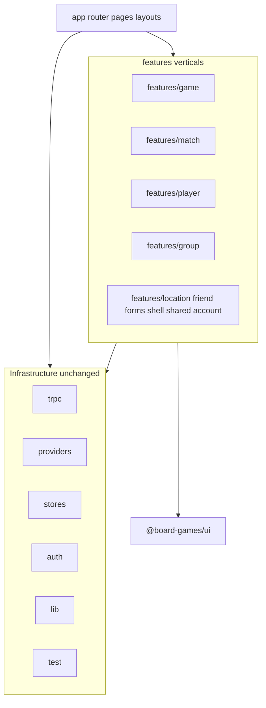

# Vertical codebase restructure (web + skills)

**Canonical location**: This umbrella and the four phase plans live in the monorepo under [`.cursor/plans/`](.) (same directory as this file).

| Doc                                                                                     | Role                                                                   |
| --------------------------------------------------------------------------------------- | ---------------------------------------------------------------------- |
| [web_vertical_restructure_0596f2bd.plan.md](web_vertical_restructure_0596f2bd.plan.md)  | Umbrella (this file)                                                   |
| [Phase 1 — leaf + shared](web_vertical_restructure_phase1_leaf_and_shared.plan.md)      | Leaf verticals, forms, shell, shared, destructive-dialog consolidation |
| [Phase 2 — core domains](web_vertical_restructure_phase2_core_domains.plan.md)          | game + match + player                                                  |
| [Phase 3 — cleanup + docs](web_vertical_restructure_phase3_cleanup_and_docs.plan.md)    | Remove old trees, skills, CLAUDE, rules                                |
| [Phase 4 — auth shell + URLs](web_vertical_restructure_phase4_auth_route_group.plan.md) | `(auth)` layout, flat `/games` routes, redirects                       |

## Principles (from the blog)

- **Group by functionality** (“verticals”), not by file kind: a game-related hook should live next to game UI, not in a global `hooks/queries` tree ([TkDodo, _The Vertical Codebase_](https://tkdodo.eu/blog/the-vertical-codebase)).
- **Colocate** components, hooks, types, and small helpers that change together; reserve [`packages/ui`](../../packages/ui) for reusable primitives and [`@board-games/ui`](../../packages/ui) imports (already aligned with “design system” in the article).
- **Cross-route shared product UI** (sidebar, nav, shared form field helpers) becomes its **own vertical** when it is not “generic UI” — same idea as Sentry’s `PageFilters` example in the post.
- **Routes stay thin**: keep using `app/**/_components` for page-only UI; those files import from `~/features/...` (colocation at the route is already consistent with the blog).

## Generic patterns (destructive confirm, similar dialogs)

The app already has [`apps/web/src/components/confirm-delete-dialog.tsx`](../../apps/web/src/components/confirm-delete-dialog.tsx) — a thin wrapper around `@board-games/ui/alert-dialog` with destructive styling and async-safe confirm handling. **Treat this as the single pattern** for “user is about to delete (or irreversibly remove) something.”

**Conventions**

- **Prefer the shared component** over ad-hoc `AlertDialog` trees in feature code for the same UX (title, description, Cancel, destructive confirm, loading on confirm). Today several call sites still use raw `AlertDialog` (e.g. some dropdowns and sheets); **Phase 1** should **refactor those** to `ConfirmDeleteDialog` (or a renamed **`ConfirmDestructiveDialog`** if you generalize copy beyond “Delete”) so behavior and a11y stay consistent.
- **Naming**: keep one canonical export per concern (delete/destructive confirm, info modal, etc.); avoid duplicating near-identical wrappers in verticals.
- **Where it lives after restructure**: under **`features/shared/components/`** (co-located with tests), imported as `~/features/shared/components/confirm-delete-dialog`. **Optional later**: move to [`packages/ui`](../../packages/ui) if you want the same API in **`apps/native`** without copy-paste — only if the API stays presentation-only (no web-only assumptions).

**Similar future patterns**: same idea — one shared component for each recurring shape (e.g. “info” explainer modal → existing `feature-info-modal` pattern), not N slight variations per vertical.

## Target layout (`apps/web/src`)

**Proposed vertical folders** (map from current [`apps/web/src/components`](../../apps/web/src/components) + [`apps/web/src/hooks`](../../apps/web/src/hooks)):

| Vertical                           | Contents (from today)                                                                                                                                                                                                                                                                                                                                                                                                                                                                                                                             |
| ---------------------------------- | ------------------------------------------------------------------------------------------------------------------------------------------------------------------------------------------------------------------------------------------------------------------------------------------------------------------------------------------------------------------------------------------------------------------------------------------------------------------------------------------------------------------------------------------------- |
| `features/game`                    | `components/game/**`, `hooks/queries/game`, `hooks/mutations/game`, `hooks/game-stats/**`                                                                                                                                                                                                                                                                                                                                                                                                                                                         |
| `features/match`                   | `components/match/**`, `hooks/queries/match`, `hooks/mutations/match`                                                                                                                                                                                                                                                                                                                                                                                                                                                                             |
| `features/player`                  | `components/player/**`, `hooks/queries/player`, `hooks/mutations/player`, `hooks/invalidate/player.tsx`                                                                                                                                                                                                                                                                                                                                                                                                                                           |
| `features/group`                   | `components/group/**`, `hooks/queries/group`, `hooks/mutations/group`                                                                                                                                                                                                                                                                                                                                                                                                                                                                             |
| `features/location`                | `components/location/**`, `hooks/queries/location`, `hooks/mutations/location`, `hooks/invalidate/location.tsx`                                                                                                                                                                                                                                                                                                                                                                                                                                   |
| `features/friend`                  | `components/friend/**`, `hooks/queries`/`mutations` under `friend` if present                                                                                                                                                                                                                                                                                                                                                                                                                                                                     |
| `features/account` (name flexible) | `components/better-auth/**` + settings-related auth UI                                                                                                                                                                                                                                                                                                                                                                                                                                                                                            |
| `features/forms`                   | `components/form/**`, `hooks/form.tsx`, `hooks/form-context.ts`                                                                                                                                                                                                                                                                                                                                                                                                                                                                                   |
| `features/shell`                   | App chrome: e.g. `app-sidebar`, `nav-*`, `breadcrumbs`, theme toggle/provider, marketing/auth forms currently at `components/*` that only serve layout/auth entry (`signup-form`, `reset-password-form`, etc.) — exact file list to be finalized when moving so nothing cross-imported is split awkwardly                                                                                                                                                                                                                                         |
| `features/shared`                  | Cross-feature widgets not suitable for `packages/ui`: includes **destructive confirmation** ([`confirm-delete-dialog`](../../apps/web/src/components/confirm-delete-dialog.tsx)), `feature-info-modal`, `formatted-date`, `spinner`, `debounced-checkbox`, `number-input`, `player-image`, `color-picker`, table helpers — **only** if truly shared; otherwise push into the closest vertical. **Policy**: new delete/destructive flows use the shared confirm component; do not add new one-off `AlertDialog` compositions for the same pattern. |

**Inside each vertical**, keep a predictable shape (still “vertical,” not a flat dump):

- `features/<name>/components/**` — current subtree from `components/<name>/`
- `features/<name>/hooks/queries`, `hooks/mutations`, `hooks/invalidate` as needed — mirror today’s hook layout **inside** the vertical

**Unchanged path aliases**: [`apps/web/tsconfig.json`](../../apps/web/tsconfig.json) keeps `"~/*": ["./src/*"]` so imports become `~/features/game/components/...`, `~/features/game/hooks/queries/...` (no new alias required).

**Delete empty trees** after migration: remove top-level `src/components` and `src/hooks` once fully drained (or leave a temporary `README` only if you stage migration — prefer not).

## Migration approach (recommended)

- **Order by dependency and size**: move smaller, leaf verticals first (`group`, `location`, `friend`), then `forms` + `shell` + `shared`, then heavy domains (`game`, `match`, `player`) where cross-imports are dense. Alternatively, a **single scripted pass** (codemod / bulk find-replace + `turbo run check --filter=web`) reduces “half old / half new” pain; choose based on how long you can keep a branch open.
- **After each chunk**: `turbo run check --filter=web` and `bun run test:web` (Vitest aliases already match `~` → [`apps/web/vitest.config.ts`](../../apps/web/vitest.config.ts)).
- **Import updates**: systematic replacement of `~/components/<domain>/` → `~/features/<domain>/components/` and `~/hooks/.../<domain>/` → `~/features/<domain>/hooks/...` (and fix relative imports inside moved files).
- **Optional follow-up** (not required for structure): `eslint-plugin-boundaries` or similar to enforce “no deep imports into another vertical’s internals,” as mentioned in the blog — can be a separate task.

## Dealing with cross-imports (game / match / player)

The problem is not TypeScript itself — it is **avoiding a long-lived hybrid** where some imports use `~/components/game/...` and others already use `~/features/match/...`, which makes reviews and grep-based fixes error-prone.

**Preferred approach: migrate the trio in one atomic change**

- Move `features/game`, `features/match`, and `features/player` (components + hooks) **in the same branch / PR**, then run one bulk import rewrite for all three.
- All cross-imports between them become stable `~/features/<x>/...` → `~/features/<y>/...` paths in a single step. `tsc` and tests validate the whole graph at once.

**If you must split work across time**

- **Do not** leave only one of the three on the old `components/` tree while the others moved — that maximizes confusing cross-boundary imports.
- Acceptable split: complete **Phase 1** (everything except game/match/player) and merge; repo stays green with old paths for the trio only. Then **Phase 2** does game+match+player together (still one PR for the trio).
- **Avoid** (unless unavoidable): temporary re-export shims under `src/components/<domain>/index.ts` pointing at `features/` — they work but add noise and a second cleanup pass; prefer the two-phase split above instead.

**Mechanical scale (~200 components, ~47 hooks)**

- Treat rewrites as **scripted or codemod-scale** (bulk find-replace with careful patterns, or `ts-morph`), not hand-editing each file.
- Let **`turbo run check --filter=web`** and **`bun run test:web`** be the gate; fix forward until green.

## Phased plans (split into multiple deliverables)

This umbrella plan stays the **architecture reference**. Split execution into **separate plan files** (or PRs) so each merge is reviewable and main stays green.

| Phase       | Scope                                                                                                                                                                                                                                                                                                                                                                                | Plan file (monorepo)                                                                                                 |
| ----------- | ------------------------------------------------------------------------------------------------------------------------------------------------------------------------------------------------------------------------------------------------------------------------------------------------------------------------------------------------------------------------------------ | -------------------------------------------------------------------------------------------------------------------- |
| **Phase 1** | `group`, `location`, `friend`, `account` (better-auth), `forms`, `shell`, `shared` — verticals with **few imports from** game/match/player, plus shared foundations other features will import. **Include**: consolidate inline delete/`AlertDialog` flows into [`ConfirmDeleteDialog`](../../apps/web/src/components/confirm-delete-dialog.tsx) where applicable as `shared` moves. | [web_vertical_restructure_phase1_leaf_and_shared.plan.md](web_vertical_restructure_phase1_leaf_and_shared.plan.md)   |
| **Phase 2** | **`game` + `match` + `player`** together (components + hooks); bulk import updates for internal cross-imports and every consumer                                                                                                                                                                                                                                                     | [web_vertical_restructure_phase2_core_domains.plan.md](web_vertical_restructure_phase2_core_domains.plan.md)         |
| **Phase 3** | Remove emptied `src/components` and `src/hooks`; refresh **skills/docs** ([`.cursor/skills/web-app-src-conventions/SKILL.md`](../../.cursor/skills/web-app-src-conventions/SKILL.md), [`CLAUDE.md`](../../CLAUDE.md), [`.cursor/rules/tanstack-form-subscribe-selector.mdc`](../../.cursor/rules/tanstack-form-subscribe-selector.mdc)); optional `rg` sweep for stale paths         | [web_vertical_restructure_phase3_cleanup_and_docs.plan.md](web_vertical_restructure_phase3_cleanup_and_docs.plan.md) |
| **Phase 4** | **App Router: `(auth)` shell + flatten URLs** — sidebar layout on `app/(auth)/layout.tsx`; **`/dashboard` = overview only**; product routes at **`/games`, `/players`, `/groups`, …** (not under `/dashboard`). See [Phase 4 details](#phase-4-authenticated-app-shell-auth-route-group).                                                                                            | [web_vertical_restructure_phase4_auth_route_group.plan.md](web_vertical_restructure_phase4_auth_route_group.plan.md) |

**Dependency rule**: Phase 1 should move **`forms`** and **`shared`** (or equivalent) **before** Phase 2 so game/match/player code that imports field helpers and small widgets already targets `~/features/forms/...` and `~/features/shared/...`, reducing churn inside Phase 2.

**Phase 4 dependency**: Prefer running after **Phase 1** (so `AppSidebar` / shell live under `~/features/shell/...`) and ideally after **Phase 3** so layout files do not still reference `~/components/...`. **URL change**: most paths move from `/dashboard/<segment>` to `/<segment>` — plan redirects (see Phase 4) for old links.

**Optional fifth item** (later): `eslint-plugin-boundaries` or barrels-only public APIs between verticals — not required for folder moves.

## Phase 4: Authenticated app shell `(auth)` route group

**Problem today**: The sidebar + session gate live in [`apps/web/src/app/dashboard/layout.tsx`](../../apps/web/src/app/dashboard/layout.tsx). Almost all product routes are nested as **`/dashboard/games`, `/dashboard/players`, …**, so “dashboard” is both the **home overview** and the **parent prefix for the whole app**, which is noisy and deep.

**Goals (two parts)**

1. **Shell**: Add a **route group** [`app/(auth)/`](../../apps/web/src/app) (parentheses = **no extra URL segment**) whose **layout** owns the authenticated shell: `SidebarProvider`, `AppSidebar`, header with breadcrumbs + theme toggle, and the `session` check / `redirect("/")` when unauthenticated — i.e. lift the current `SidebarLayout` from [`dashboard/layout.tsx`](../../apps/web/src/app/dashboard/layout.tsx) into **`app/(auth)/layout.tsx`**.
2. **Flat URLs**: Under `(auth)`, **only** the overview uses the `/dashboard` segment. Feature routes become **top-level paths** next to it, not children of `dashboard`:

| Current (typical)                                                                                                                               | Target                                                                                                                                                                                                   |
| ----------------------------------------------------------------------------------------------------------------------------------------------- | -------------------------------------------------------------------------------------------------------------------------------------------------------------------------------------------------------- |
| `/dashboard`                                                                                                                                    | `/dashboard` — **unchanged**; stays the logged-in home / charts ([`app/dashboard/page.tsx`](../../apps/web/src/app/dashboard/page.tsx) + [`_components/`](../../apps/web/src/app/dashboard/_components)) |
| `/dashboard/games`, `/dashboard/games/...`                                                                                                      | `/games`, `/games/...`                                                                                                                                                                                   |
| `/dashboard/players`, `/dashboard/players/...`                                                                                                  | `/players`, `/players/...`                                                                                                                                                                               |
| `/dashboard/groups`, `/dashboard/friends`, `/dashboard/locations`, `/dashboard/calendar`, `/dashboard/share-requests`, `/dashboard/settings`, … | `/groups`, `/friends`, `/locations`, `/calendar`, `/share-requests`, `/settings`, … (same path suffixes and dynamic segments after the first segment)                                                    |

**Filesystem layout (illustrative)**

- `app/(auth)/layout.tsx` — sidebar shell + session gate.
- `app/(auth)/dashboard/page.tsx` (+ `app/(auth)/dashboard/_components/`) — **only** dashboard overview widgets.
- `app/(auth)/games/**`, `app/(auth)/players/**`, `app/(auth)/groups/**`, … — moved from today’s `app/dashboard/<segment>/**` (not nested under a `dashboard` folder in the URL).

**Concrete steps**

1. Add **`app/(auth)/layout.tsx`** with the same shell behavior as today’s dashboard layout (imports from `~/features/shell/...` after vertical restructure).
2. **Split** the current [`app/dashboard`](../../apps/web/src/app/dashboard) tree:
   - Keep **`dashboard/page.tsx`** and **`dashboard/_components/`** under `app/(auth)/dashboard/` (overview only).
   - **Move** each other first-level segment (`games`, `players`, `groups`, `locations`, `friends`, `calendar`, `share-requests`, `settings`, …) to **`app/(auth)/<segment>/`** at the **root of the group** (siblings of `dashboard/`), so URLs flatten as in the table above.
3. **Remove** the old `app/dashboard/layout.tsx` after the shell lives on `(auth)/layout.tsx` (no nested duplicate shell on `dashboard`).
4. **Update every navigation surface**: [`app-sidebar`](../../apps/web/src/components/app-sidebar.tsx) (or `~/features/shell/...`), [`nav-secondary`](../../apps/web/src/components/nav-secondary.tsx), breadcrumbs, [`linkFormatting`](../../apps/web/src/utils/linkFormatting.ts), in-app `Link`/`router.push`, and **metadata** / **openGraph** URLs if they hardcode `/dashboard`.
5. **Backwards compatibility**: Add **redirects** (e.g. in [`next.config.ts`](../../apps/web/next.config.ts) `redirects` or middleware) from `/dashboard/games` → `/games` (and likewise for other moved prefixes) so old bookmarks and shared links keep working during rollout.
6. **Audit**: [`middleware.ts` / `proxy`](../../apps/web/src), auth callbacks, and any **string** checks for paths starting with `/dashboard` that should now allow `/games`, `/players`, etc.
7. **Out of scope**: Unauthenticated routes (`/login`, `/sign-up`, …) stay **outside** `(auth)`. The group name `(auth)` means **authenticated session + app chrome**; use `(app)` or `(main)` if you prefer to avoid confusion with “auth pages.”

**Docs**: Describe the `(auth)` shell, that **`/dashboard` is only the overview**, and that feature URLs are **`/<feature>/...`**; document redirect policy for old `/dashboard/<feature>` paths.

**Testing / E2E**: Update Playwright or any tests that navigate to `/dashboard/games`-style URLs.

## Docs and skills to update

| File                                                                                                             | Change                                                                                                                                                                                                                                                                                                                                                                                                                                                                                  |
| ---------------------------------------------------------------------------------------------------------------- | --------------------------------------------------------------------------------------------------------------------------------------------------------------------------------------------------------------------------------------------------------------------------------------------------------------------------------------------------------------------------------------------------------------------------------------------------------------------------------------- |
| [`.cursor/skills/web-app-src-conventions/SKILL.md`](../../.cursor/skills/web-app-src-conventions/SKILL.md)       | Rewrite conventions: `features/<vertical>/` colocation; `packages/ui` vs `features/*` vs route `_components`; updated import examples; remove “hooks must live in `src/hooks`” rule; **add**: destructive/delete confirmation → shared `ConfirmDeleteDialog` from `~/features/shared/...`, not new raw `AlertDialog` copies; **add (Phase 4)**: `app/(auth)/layout.tsx` = shell; **`/dashboard`** = overview only; feature routes at **`/games`, `/players`, …** (not `/dashboard/...`) |
| [`CLAUDE.md`](../../CLAUDE.md)                                                                                   | Update “UI Components” bullet: app-specific UI under `apps/web/src/features/...` instead of only `apps/web/src/components/`                                                                                                                                                                                                                                                                                                                                                             |
| [`.cursor/rules/tanstack-form-subscribe-selector.mdc`](../../.cursor/rules/tanstack-form-subscribe-selector.mdc) | Point the canonical example at the new path (e.g. `features/match/components/.../selector.tsx`)                                                                                                                                                                                                                                                                                                                                                                                         |

**Search after edits**: `rg 'apps/web/src/components|~/components/'` across repo to catch stray references in rules or docs.

## Out of scope / non-goals

- **Native app** (`apps/native`): unchanged unless you explicitly want the same naming there later.
- **New packages per vertical** in the monorepo: the blog suggests package boundaries; this plan stays within `apps/web` unless you later promote a vertical to `packages/*` with `exports` (larger change).
- **Fixing the typo** `app/dashboard/share-requests/[id]/_componenets/` — optional cleanup while touching those paths.
